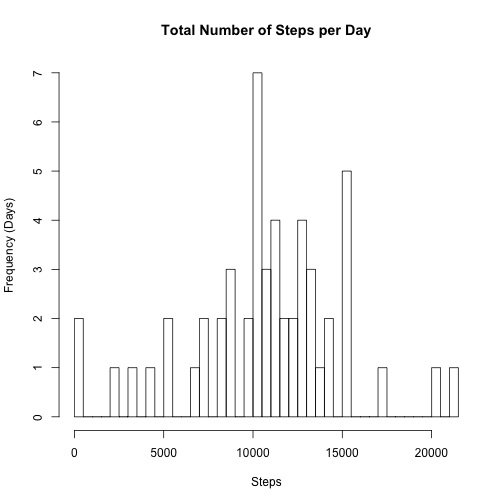
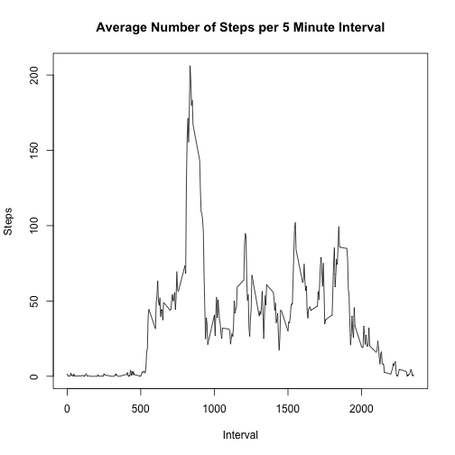
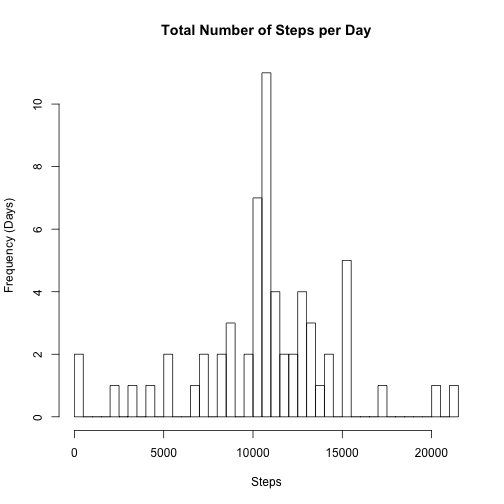
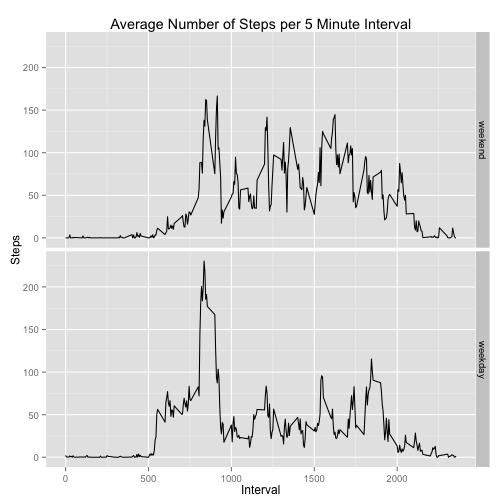

The data from this assigment consists of two months of data from an anonymous individual collected during the months of October and November, 2012 and include the number of steps taken in 5 minute intervals each day.

## Loading and preprocessing the data
Load necessary libaries and read data into data frame


```r
library(ggplot2)
unzip("activity.zip")
activityData <- read.csv("activity.csv")
```

## What is mean total number of steps taken per day?
The histogram shows the total number of steps taken per day


```r
agg_daily <- aggregate(steps ~ date, data = activityData,sum)
hist(agg_daily$step, breaks=nrow(agg_daily),  main="Total Number of Steps per Day", xlab="Steps", ylab="Frequency (Days)")
```

 

The mean and median total number of steps taken per day are shown below

```r
mean_steps <- mean(agg_daily$steps)
median_steps <- median(agg_daily$steps)
```
Mean steps: 1.0766189 &times; 10<sup>4</sup>

Median steps: 10765

## What is the average daily activity pattern?
A time series plot of the 5-minute and the average number of steps taken, averaged across all days

```r
agg_interval <- aggregate(steps ~ interval, data = activityData,mean)
plot(agg_interval$interval, agg_interval$steps, type="l", main="Average Number of Steps per 5 Minute Interval", xlab="Interval", ylab="Steps")
```

 

The 5-minute interval (on average across all the days in the dataset) and exact minute that contains the maximum number of steps

```r
max_interval <- with(agg_interval,order(steps, decreasing = TRUE))[1]
max_minute <- agg_interval[max_interval,c('interval')]
```

Max interval: 104 interval

Max Minute: 835 minute

## Imputing missing values
Figuring out the total number of missing values in the dataset 

```r
agg_interval$mean_steps <- agg_interval$steps

mergedData <- merge(activityData,agg_interval[,c('interval','mean_steps')],by="interval")

na_steps <- is.na(mergedData$steps)
```

Number of missing values: 2304

Replace missing values (steps) with average number of steps for that day with floor function

```r
mergedData$replaced_steps <- ifelse(is.na(mergedData$steps),floor(mergedData$mean_steps),mergedData$steps)
```

The new histogram below shows the total number of steps taken each day after replacing the missing values

```r
agg_interval <- aggregate(replaced_steps ~ date, data = mergedData,sum)

hist(agg_interval$replaced_steps, breaks=nrow(agg_interval),  main="Total Number of Steps per Day", xlab="Steps", ylab="Frequency (Days)")
```

 

The new mean and median total number of steps taken per day are shown below after replacing the missing values

```r
new_mean_steps <- mean(agg_interval$replaced_steps)
new_median_steps <- median(agg_interval$replaced_steps)
```

Mean steps: 1.074977 &times; 10<sup>4</sup>

Median steps: 1.0641 &times; 10<sup>4</sup>

The new mean and median do differ from the original estimates from the first part of the assignment. They vary by the following amounts:

Change of mean steps: -0.1524977 %

Change of median steps: -1.1629232 %

## Are there differences in activity patterns between weekdays and weekends?
Create a new factor variable in dataset wit two levels: weekday and weekend

```r
mergedData$category_day <- factor(as.POSIXlt(mergedData$date)$wday)
levels(mergedData$category_day) <- c("weekend","weekday","weekday","weekday","weekday","weekday","weekend")
```

A panel plot with a time series plot of the 5-minute interval and the average number of steps taken, averaged across all weekdays and weekend days

```r
agg_interval <- aggregate(replaced_steps  ~ interval + category_day, data = mergedData,mean)

ggplot(agg_interval, aes(x = interval, y = replaced_steps)) + geom_line() + facet_grid(category_day ~ . ) + labs(x = "Interval") + labs(y = "Steps") + labs(title = "Average Number of Steps per 5 Minute Interval");
```

 
