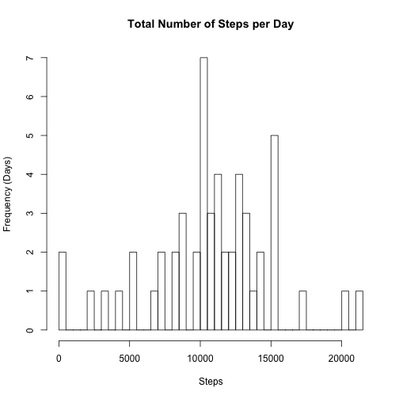
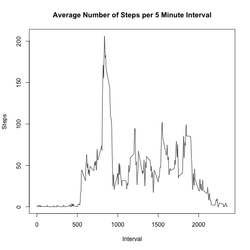
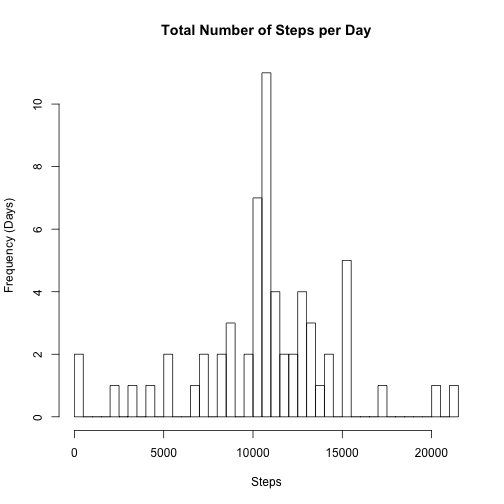
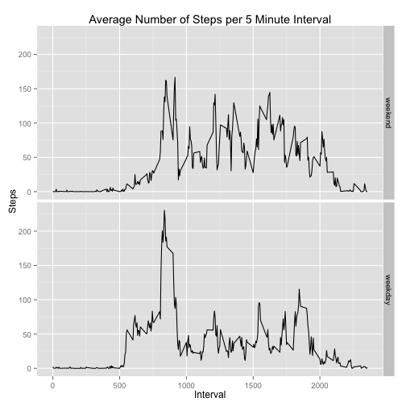

## Loading and preprocessing the data

```r
library(ggplot2)
unzip("activity.zip")
activityData <- read.csv("activity.csv")
```

## What is mean total number of steps taken per day?

```r
agg_daily <- aggregate(steps ~ date, data = activityData,sum)

hist(agg_daily$step, breaks=nrow(agg_daily),  main="Total Number of Steps per Day", xlab="Steps", ylab="Frequency (Days)")
```

 

```r
mean_steps <- mean(agg_daily$steps)

median_steps <- median(agg_daily$steps)
```

Mean steps: 1.0766189 &times; 10<sup>4</sup>

Median steps: 10765

## What is the average daily activity pattern?

```r
agg_interval <- aggregate(steps ~ interval, data = activityData,mean)
plot(agg_interval$interval, agg_interval$steps, type="l", main="Average Number of Steps per 5 Minute Interval", xlab="Interval", ylab="Steps")
```

 

```r
max_interval <- with(agg_interval,order(steps, decreasing = TRUE))[1]

max_minute <- agg_interval[max_interval,c('interval')]
```

Max interval: 104

Max Minute: 835

## Imputing missing values

```r
agg_interval$mean_steps <- agg_interval$steps

mergedData <- merge(activityData,agg_interval[,c('interval','mean_steps')],by="interval")

na_steps <- is.na(mergedData$steps)

mergedData$replaced_steps <- ifelse(is.na(mergedData$steps),floor(mergedData$mean_steps),mergedData$steps)

agg_interval <- aggregate(replaced_steps ~ date, data = mergedData,sum)

hist(agg_interval$replaced_steps, breaks=nrow(agg_interval),  main="Total Number of Steps per Day", xlab="Steps", ylab="Frequency (Days)")
```

 

```r
mean_steps <- mean(agg_interval$replaced_steps)

median_steps <- median(agg_interval$replaced_steps)
```

Number of missing values: 2304

Mean steps: 1.074977 &times; 10<sup>4</sup>

Median steps: 1.0641 &times; 10<sup>4</sup>

## Are there differences in activity patterns between weekdays and weekends?

```r
mergedData$category_day <- factor(as.POSIXlt(mergedData$date)$wday)
levels(mergedData$category_day) <- c("weekend","weekday","weekday","weekday","weekday","weekday","weekend")

agg_interval <- aggregate(replaced_steps  ~ interval + category_day, data = mergedData,mean)

ggplot(agg_interval, aes(x = interval, y = replaced_steps)) + geom_line() + facet_grid(category_day ~ . ) + labs(x = "Interval") + labs(y = "Steps") + labs(title = "Average Number of Steps per 5 Minute Interval");
```

 
